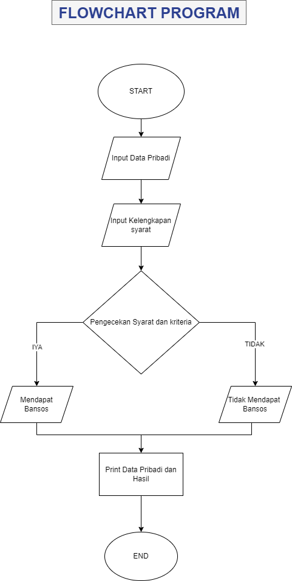

## PROGRAM BANTUAN BANSOS

# STUDI KASUS
Pemerintah Indonesia sedang melaksanakan program bantuan sosial untuk warga yang memenuhi kriteria tertentu. Untuk memudahkan proses pendaftaran dan seleksi, mereka mengembangkan sebuah sistem sederhana yang dapat menentukan kelayakan seseorang untuk menerima bantuan sosial berdasarkan beberapa kriteria.

Program harus menerima input berupa :

Data Pribadi
1. Nama
2. Nik
3. Tempat Tinggal
4. No handphone

Syarat Kelengkapan
1. kewarganegaraan
2. Pekerjaan
3. Keaktifan BPJS
4. Gaji 

Kriteria
1. Pekerjaan yang tidak bisa mendapatkan bansos (Tni, ASN, Polri)
2. Harus WNI
3. Aktif dalam program BPJS
4. Gaji harus <= 2000000

Jika warga memenuhi kriteria, maka program akan mencetak nama, nik, tempat tinggal, pekerjaan, no hp, dan hasil bahwa warga tersebut mendaoatkan Bansos. jika tidak, program akan mencetak pesan yang sesuai

## FLOWCART
